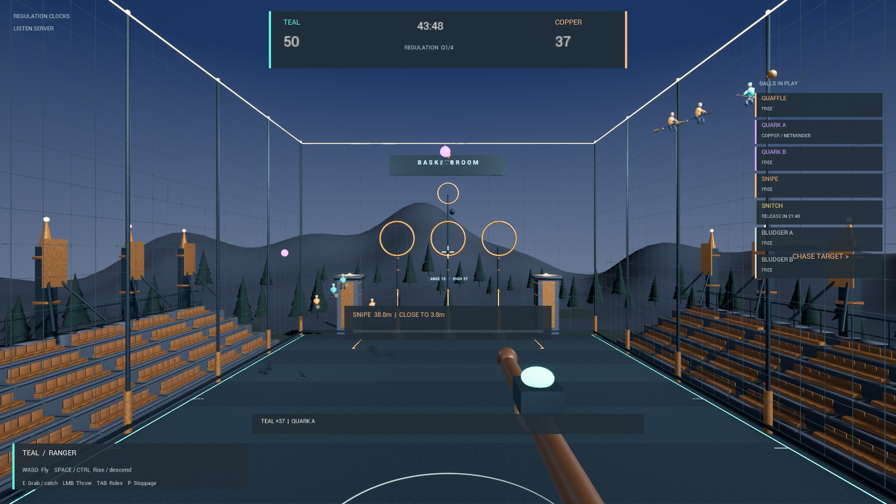

# Basketbroom — UE5.8 broom sport

A first-person broom sport alpha built in **Unreal Engine 5.8**. The active native
game has two opposing eight-rider teams, selectable positions, seven balls, broom flight,
ballistic goals, continuous chase catches, and regulation match state in an
original arena enclosed by a hollow pyramid net. The native Editor and Windows Development game build
successfully. Focused gameplay, opening, rematch, Bludger, local networking,
and audio suites pass. Two packaged processes also share role changes, scores,
stoppages, certified results and host rematches in local play. Full regulation,
remote multiplayer validation, and final art remain in development.



The active project is `DevelopmentHarness/BasketbroomDev.uproject`. The folder
name is historical: this is now a standalone UE5.8 game project. It is not an
installable Hogwarts Legacy mod. Creator Kit research and the original mod
port remain in `Docs/` and `Mod/`; UE5.8 assets are not compatible
with Hogwarts Legacy's Creator Kit engine.

The Creator Kit port now has a saved dungeon, native return actor and registered
entrance SQL. Launching the Kit through Epic resolved its WB sign-in failure.
Normal Creator Kit Play now passes 16 runtime checks for native player spawn,
mod tables and exit setup, followed by clean shutdown. Actual entry/return
interaction and match gameplay remain in development. See
[Hogwarts sprint 3](Docs/hogwarts-sprint3.md) for the evidence and next steps.

The next geometry change is [40–50% more enclosed arena volume](Docs/arena-volume-expansion.md),
targeting 45%; the current game has not yet been resized.

## Play

Double-click **Play.cmd**, or run the command below from this repository.
The launcher prefers the latest local packaged Windows build, which does not
require Unreal Editor. The current package contains the native regulation alpha
and the earlier training map. Build output is local and is not committed to Git.

From a PowerShell terminal in this repository:

```powershell
.\Play.ps1
.\Play.ps1 -Practice
.\Play.ps1 -Bloodbroom -Practice
.\Play.ps1 -Mode Training
```

**Practice.cmd** opens the accelerated native match. **Bloodbroom.cmd** opens
that practice match in Bloodbroom mode. **Local-Multiplayer.cmd** opens a packaged
host and client on this computer with practice clocks.

`Play.ps1 -Bloodbroom` selects Bloodbroom with ordinary clocks; add `-Practice`
for accelerated clocks. It uses the native regulation map and cannot be combined
with `-Mode Training`. Add `-Plan` to inspect the launch command without opening
the game.

For a desktop launcher, run `./Install-DesktopShortcut.ps1` in PowerShell. It
creates **Basketbroom** on your current Windows Desktop and opens Practice mode
through this checkout's `Play.ps1`, so later completed local packages are used
automatically. Run it again to refresh the shortcut and package icon. Keep this
checkout in place; unrelated same-named shortcuts are preserved, and the
installer does not change Windows security settings.

The default `-Mode Auto` uses the latest package and its native regulation map.
`-Practice` uses accelerated native clocks: three-minute quarters and a Snitch
release after one minute of live play. `-Mode Training` selects the retained
five-minute Blueprint scrimmage described below. These open a 1600 × 900 game
window. If no local package exists,
the launcher uses an installed Unreal Engine **5.8** editor in game mode.
Use `-EditorGame` to force that mode, or change the window size:

```powershell
.\Play.ps1 -Width 1920 -Height 1080
.\Play.ps1 -EditorGame -EngineRoot 'D:\Epic Games\UE_5.8'
```

Click inside the game window to take control. `Alt+F4` closes the game.

- **W / A / S / D:** fly forward, left, backward and right.
- **Mouse:** look and aim. Forward flight follows your view.
- **Space / Left Ctrl:** rise and descend.
- **E:** pick up a nearby free ball permitted for your position.
- **Left mouse button:** throw the ball along your aim; account for its drop.
- **Hold E:** remain within **3.8 meters** of a Snipe or Snitch for **one continuous second** as a Ranger or Scout. Release any carried ball first; the HUD shows range and capture progress.
- **1–6:** choose Netminder, Chaser, Trapper, Ranger, Hurleyback, or Scout during the lobby or a stoppage.
- **T:** switch teams during the lobby or a stoppage. **Tab:** show the position guide.
- **Enter:** host starts/resumes play, or starts a new match after the certified final result. **P:** host calls a stoppage.
- **Q:** cast. **Z / X:** select a spell. **R:** Protego. **V:** spellbook.
- **B:** host selects Bloodbroom in the initial lobby. **F6 / F7 / F8 / F9:** host serves a pending BB-0 call with a Moderate free shot, possession, a Serious shot plus removal, or ejection in the playtest referee interface.

Gamepad bindings and their validation status are documented in
[controller support](Docs/controller-support.md). The four-minute prototype
showcase includes all six positions and actual **3840 × 2160, 16:9, 60 fps** gameplay with automated camera
and gameplay staging; see the [capture and edit workflow](Docs/gameplay-promo.md).

You begin in a Ranger slot and can choose another position before play.
Put the red-orange **Quaffle** through a large hoop for **13** points or a purple
**Quark** through the small upper hoop for **37**. Catch the copper **Snipe** for
**69**; it returns after three live minutes. The golden **Snitch** awards **150**
in regulation or **300** in overtime; final results follow the rules engine's
phase and review logic. Regulation retains four **44-minute quarters**, with
the Snitch scheduled after **22 minutes** of live play. Practice releases it
after **one minute**. The Snipe travels at 60% of the Snitch's speed.

Capture progress resets on release or a range break. Ordinary scoring positions
carry Quaffles and Quarks; Hurleybacks handle Bludgers; Rangers and Scouts chase.
Role and team changes are locked while play is live.
Rematches retain teams and selected positions while resetting scores, clocks,
equipment, and the opening layout. Ordinary stoppages preserve field positions;
new quarters and phases use their defined opening layouts.

## What is implemented

The [BB-0 wandplay adapter](Docs/native-wandplay.md) and [sprint 3 spellwork](Docs/native-sport-spells.md)
implement **23 of 31 spell-menu actions**, including Revelio, Disillusionment,
Petrificus Totalus, Transformation and sporting Imperio. The spellbook retains
eight contextual actions with their adapters marked pending. Vitality, wand/shield
visuals and conduct review follow applied hits. Bloodbroom waives Unforgivables
and headshots only; other sporting restrictions remain shared. Spell tuning and
referee choices remain provisional. See the [sprint 3 handoff](Docs/sprint-3-spells-graphics.md)
for current controls, completed gameplay/network/package validation and remaining work.

`DevelopmentHarness/Source/BasketbroomRuntime/` now supplies the enabled native
C++ runtime: CharacterMovement broom flight, authority-owned balls, the sixteen
roster slots, position/team selection, host start/stoppage, goal and capture
resolution, and replicated HUD state. It spawns one Quaffle, two Quarks, one
Snipe, one scheduled Snitch, and two Bludgers. Goal checks require the whole ball
to clear the appropriate hoop. The [closed pyramid net](Docs/pyramid-net.md)
replaces the old No Crown return: balls rebound off four sloping roof faces and
remain in play in both Basketbroom and Bloodbroom. The former 138-foot roofline
is now an open interior eave plane, with the provisional apex at 207 feet.
Riders and held/chase balls share the closed arena bounds. Existing dated
validation receipts retain their original build scope; the amendment describes
the replacement native checks.

The venue, team colors, broom cockpit and HUD use generated original assets.
Sprint 3 also supplies [original layered broom and wand art](SourceArt/Equipment/broom_equipment.md);
its final rendered/package validation belongs to the sprint handoff.
Riders now use Epic's locally staged Quinn mannequin with an authored seated
flight animation and team materials. Python authors saved Unreal assets; native matches run in C++. Native
pickup, throw, goal, and Snipe-catch events trigger original synthesized sounds.
The retained training mode runs in compiled Blueprints and has four original
sounds for throw, score, catch, and bounce feedback.

The current visual pass adds an original basalt texture, material variation,
stadium masonry/seating, terrain, trees, metal goal rims and twilight lighting.
The latest pass adds animated skeletal riders and original flapping copper
Snipe and ivory Snitch wings. Both teams and both chase balls have been rendered
and inspected in the native game. See `Docs/skeletal-rider-art.md` and
`Docs/chase-equipment-art.md` for reproducible asset setup and current limits.
The original Hurley prop has also passed native rendering checks. Its
approximately 103 cm overall length and open shallow
pocket are provisional: the current oversized Bludger does not physically fit.
This visual addition does not implement striking or certify equipment dimensions.

The [native shot flow](Docs/native-penalty-shots.md) includes a host-selected
**Moderate free shot without removal** and the separate Serious shot plus
live-time removal in both modes. F6, or D-pad Left then Menu during a review,
selects the free shot. It preserves the foul's lateral position and altitude,
projects backward along X only when needed for the minimum 44-foot goal-plane
distance, and keeps nonkeeper defenders at least 22 feet away until release.
Its stopped five-second attempt, restricted participant actions and protected
keeper restart are explicit prototype administration choices. Full regulation
still needs post-termination restorative shots, full spell parity, and complete
officiating/adjudication flows. The rules engine has broader phase and penalty
coverage than the current in-game presentation. Sport-specific animation,
finished character assets, match balance, and audio mixing need further work.
Passing the focused native checks does not certify every regulation phase or
autonomous match behavior.

## Retained training mode

Use `Play.ps1 -Mode Training` for `/Basketbroom/Maps/BB_Arena`. You occupy Teal's
Ranger slot for a five-minute scrimmage with fifteen bots and five balls. Both
chase balls are available immediately; the Snitch ends that training game.
**R** restarts it. This mode uses simplified rules, permits training pickups
from bots, and has no live Bludgers or position switching. Its Ranger HUD shows
chase distances, hold progress, a projected target label, and an off-screen hint.
Earlier standalone training packages remain available in the local build folder.

## Native builds and multiplayer development

Earlier baseline validation recorded **68 C++ scenarios**, including the
54 reference cases, and **35/35** native Unreal integration checks in one
authority PIE world. That milestone's combined native run passed
**96/96** checks across gameplay, admission, disconnect, networking, opening and
Snitch suites. Native Editor compilation and Win64
Development compilation/cooking/packaging succeeded using Visual Studio 2026,
MSVC **14.51.36257**, Windows SDK **26100**, and the .NET Framework **4.8 SDK**.
The regulation map is staged and enabled. Packaged native startup and a
two-process loopback connection passed. Native visual/input review is separate
from these automated checks.

To prepare another machine and rebuild the native editor target:

```powershell
.\Install-BuildTools.ps1
.\Build-Native.ps1
```

Windows may require administrator approval for Microsoft's signed installer.
After compilation, reopen the editor and run `Tools/stage_regulation.py` as
needed. Reproduce the locally staged Epic mannequin dependencies and authored
rider assets using `Tools/stage_skeletal_rider.py` as described in
`Docs/skeletal-rider-art.md`; those stock dependencies are not stored in Git.
Use `Multiplayer.ps1 -Mode LocalTest` for a
listen server and loopback client, `-Mode Host`, or `-Mode Join -Address <host>`.
Add `-Bloodbroom` to **Host** or **LocalTest** to select that match variant, for
example `./Multiplayer.ps1 -Mode LocalTest -Bloodbroom -Practice`. Joining players
inherit the server's variant; `-Mode Join -Bloodbroom` is rejected. Both host and
client command plans can be inspected with `-Plan` without starting a process.
All seventeen same-process networking checks pass, including client flight,
pickup, and throw replication. The launcher prefers the
native package; use `-EditorGame` to force Unreal's development game mode.
Remote transport, latency, and gameplay across separate processes still need
validation beyond the passing packaged connection check. LAN/direct IP
comes first; Steam/Epic discovery, authentication, and invites are not implemented.
See `Docs/native-validation.md`, `Docs/native-rules.md`, and `Docs/networking.md`.

## Open and rebuild

```powershell
.\Open-Editor.ps1
```

The active native map is `/Basketbroom/Maps/BB_Regulation`; the training map is
`/Basketbroom/Maps/BB_Arena`. Generated assets are stored in
`DevelopmentHarness/Plugins/Basketbroom/Content/`, mounted as `/Basketbroom`.
The project's Python and Editor Scripting Utilities plugins are enabled.
These authoring plugins are restricted to Editor targets.

To rebuild from the checked-in authoring sources, save your editor work, stop
Play In Editor, open **Output Log**, choose **Python** in its command selector,
and run:

```python
import runpy; runpy.run_path(r"C:\Git\basketbroom\Tools\build_all.py", run_name="__main__")
```

Adjust the path if you cloned elsewhere. This regenerates the owned training
Blueprints and arena assets in dependency order:

1. `build_audio`: original source WAVs and imported sound assets.
2. `build_gameplay`: match, balls and player flight, including sound triggers.
3. `build_arena`: meshes, materials, venue and lighting.
4. `build_hud`: scoreboard, controls and match result.
5. `stage_game`: game mode, player start, five balls and cockpit.
6. `build_bots`: rider movement, possession and shooting.
7. `stage_bots`: mounted visuals and the fifteen-bot roster.

The builder saves the assets and arena, and writes progress/results to
`.local/build-all-results.json`. Generated Blueprint graphs are replaced;
edit their Python sources to preserve changes across rebuilds. Arena builders
replace their tagged actors and retain unrelated untagged venue actors.
After training authoring, run `Tools/stage_regulation.py` to select and stage
the native map again. Recompile C++ changes with `Build-Native.ps1`; the Python
authoring pipeline does not compile native source.

To package saved assets into a Windows executable:

```powershell
.\Package.ps1
```

With the native module enabled, packaging builds the native game target and
cooks both regulation and training maps. The earlier content-only training
packaging path uses UE5.8's installed game binary when the module is disabled.
Each run creates a new `.local/Build/Development-<timestamp>/Windows`
directory and updates the launcher's latest-package pointer on success. Keep
the entire `Windows` folder together when copying a build. `-Plan` checks inputs
without cooking; `-Configuration Shipping` selects a Shipping build.

## Checks and source layout

With Python 3.10 or later, these checks run without Unreal:

```powershell
python -m unittest discover -s Rules -v
python -m compileall -q Tools Rules
```

Completed checks include **54 Python rule-reference tests**, **68 portable C++
rules scenarios**, **35 native gameplay checks**, **19 practice Snitch/rematch
checks**, **11 opening-layout checks**, **9 Bludger checks**, **17 local network
checks**, **7 admission checks**, **7 disconnect checks**, and **11 native audio checks**. The retained
training mode also passed **15 gameplay**, **15 AI**, and **4 flight** checks;
its final chase HUD rebuild was rechecked and packaged. These suites have
different scopes: reference rules do not exercise Unreal actors, and authority
PIE results do not establish remote networking.
`Tools/test_playable.py` exercises training gameplay in Unreal Play In Editor, while
`Tools/test_bots.py` provides separate AI integration checks for the roster,
possession and Blueprint shooting behavior. `Tools/test_flight.py` reloads the
training map, checks spawn clearance, verifies the real player spawn, and measures
horizontal and vertical pawn movement with collision enabled.

`Tools/test_native_playable.py` verifies roster/roles, host controls, movement
bounds, ball physics, goals, eligibility, and Snipe capture in the native map.
`Tools/test_native_network.py` exercises two PIE worlds in one editor process.
`Tools/test_native_audio.py` observes sound assets, gameplay-triggered audio
components, suppression of repeated cues, and component cleanup; it does not
verify speaker output or the subjective mix. `Tools/test_native_snitch.py`
passed its separate practice release/catch/result/rematch suite: timed release
at 60 live seconds, hold/reset behavior, a 150-point catch, winner certification,
and a clean host rematch that retains the roster. That
suite slows PIE time to 0.1x and follows the Snitch during capture; it does not
validate normal-speed physical chasing or the 22-minute regulation release.
`Tools/test_native_openings.py` follows actual practice clocks through four
quarters, overtime, and Donnybrook, carrying a 37–37 tie created by two real
Quark goals. `Tools/test_native_bludgers.py` checks control-clock resets, impact
clearance, and opposing-Hurleyback restarts in isolated PIE fixtures.
Training interactive checks verified E pickup, mouse release, a 13-point goal,
mouse aim, and packaged startup. Those observations are not native packaged
validation. September 12 native packaged checks exercised physical **6/T**
position/team selection, **Tab** help, and host **P/Enter** stoppage/resume.
The final package also passed two-process loopback checks for client **5**
Hurleyback selection, host-only controls, matching final results and stoppage
state, host rematch, and continued play after a graceful client departure.
Manual chase capture, remote networking, flight feel and the audio mix still
need further playtesting.
The [4K landscape prototype showcase](Docs/gameplay-promo.md) records current
native features and their observed outcomes; it does not claim final art or
completed Hogwarts Legacy integration.
See `Docs/validation.md` for evidence and limits; local reports describe individual
runs and do not guarantee that every later rebuild passes.

- `Tools/`: Unreal authoring, staging and editor test scripts.
- `SourceArt/Arena/`: deterministic source geometry and the arena manifest.
- `SourceArt/Audio/`: original, reproducible synthesized WAV sources.
- `SourceArt/Textures/`: original generated stone texture and provenance.
- `Rules/`: executable rules reference and tests; see `Rules/README.md`.
- `Docs/basketbroom_rules_bible_v0.1.md`: supplied design reference.
- `DevelopmentHarness/`: active UE5.8 project and generated playable content.
- `Mod/`: UE4.27 Creator Kit port sources and native assets, separate from the UE5.8 game. See `Docs/hogwarts-integration.md`; no playable/published mod is claimed.

If `python` resolves to the Windows Store alias on this workstation, the bundled
interpreter is at
`C:\Users\bigdi\.cache\codex-runtimes\codex-primary-runtime\dependencies\python\python.exe`.
