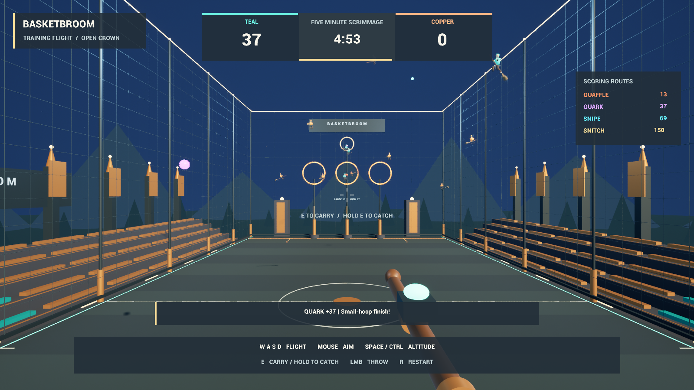

# Basketbroom — first playable training prototype

A first-person broom sport training prototype built in **Unreal Engine 5.8**.
Fly for Teal against Copper in an original open-crown arena with mounted riders,
glowing balls, ballistic throws and a live scoreboard. The current milestone is
a five-minute scrimmage that establishes flight, ball handling, scoring and basic
opponents; the full Basketbroom rules remain a work in progress.



The active project is `DevelopmentHarness/BasketbroomDev.uproject`. The folder
name is historical: this is now a standalone UE5.8 game project. It is not an
installable Hogwarts Legacy mod. Creator Kit research and the original mod
scaffold remain in `Docs/` and `Mod/` for reference; UE5.8 assets are not compatible
with Hogwarts Legacy's Creator Kit engine.

## Play

Double-click **Play.cmd**, or run the command below from this repository.
The launcher prefers the latest local packaged Windows build, which does not
require Unreal Editor. Build output is local and is not committed to Git.

From a PowerShell terminal in this repository:

```powershell
.\Play.ps1
```

This opens the arena in a 1600 × 900 game window. If no local package exists,
the launcher uses an installed Unreal Engine **5.8** editor in game mode.
Use `-EditorGame` to force that mode, or change the window size:

```powershell
.\Play.ps1 -Width 1920 -Height 1080
.\Play.ps1 -EditorGame -EngineRoot 'D:\Epic Games\UE_5.8'
```

Click inside the game window to take control. `Alt+F4` closes the game.

- **W / A / S / D:** fly forward, left, backward and right.
- **Mouse:** look and aim. Forward flight follows your view.
- **Space / Left Ctrl:** rise and descend.
- **E:** pick up a nearby Quaffle or Quark, including one carried by a bot.
- **Left mouse button:** throw the ball along your aim; account for its drop.
- **Hold E:** stay near a Snipe or Snitch for one continuous second to catch it.
- **R:** restart the scrimmage.

You occupy Teal's Ranger slot. Teal attacks the far end from the opening spawn.
Put the red-orange **Quaffle** through a large hoop for **13** points or a purple
**Quark** through the small upper hoop for **37**. Catch the cyan **Snipe** for
**69**; it returns after three minutes. The golden **Snitch** awards **150** and
ends this training game. The scrimmage otherwise ends after **five minutes**.

## What is implemented

The training slice contains sixteen riders: the player, seven Teal bots and eight
Copper bots. Simple scoring bots pursue assigned balls, carry them, and shoot at
real goal planes. Hurleybacks and Scouts currently patrol. There is one Quaffle,
two Quarks, one Snipe and one Snitch. Goal checks account for ball clearance, and
ordinary balls bounce off arena boundaries or return after a crown exit.

The venue, team colors, riders, broom cockpit and HUD are generated original
assets. Four original synthesized sounds provide throw, score, catch and bounce
feedback. Python authors saved Unreal assets; the playable match runs in native
Blueprints without Python ticking its gameplay.

This is an early playable training game, not the complete ruleset. There are no
live Bludgers, spells, multiplayer, character animation, full officiating,
regulation quarters, overtime, Donnybrook or substitutions yet. Training capture
and role behavior are simplified, and both chase balls are available from the
start. The rules reference's broader coverage does not imply runtime support.

## Open and rebuild

```powershell
.\Open-Editor.ps1
```

The arena map is `/Basketbroom/Maps/BB_Arena`. Generated assets are stored in
`DevelopmentHarness/Plugins/Basketbroom/Content/`, mounted as `/Basketbroom`.
The project's Python and Editor Scripting Utilities plugins are enabled.
These authoring plugins are restricted to Editor targets.

To rebuild from the checked-in authoring sources, save your editor work, stop
Play In Editor, open **Output Log**, choose **Python** in its command selector,
and run:

```python
import runpy; runpy.run_path(r"C:\Git\basketbroom\Tools\build_all.py", run_name="__main__")
```

Adjust the path if you cloned elsewhere. This regenerates the owned gameplay
Blueprints and arena content in dependency order:

1. `build_audio`: original source WAVs and imported sound assets.
2. `build_gameplay`: match, balls and player flight, including sound triggers.
3. `build_arena`: meshes, materials, venue and lighting.
4. `build_hud`: scoreboard, controls and match result.
5. `stage_game`: game mode, player start, five balls and cockpit.
6. `build_bots`: rider movement, possession and shooting.
7. `stage_bots`: mounted visuals and the fifteen-bot roster.

The builder saves the assets and arena, and writes progress/results to
`.local/build-all-results.json`. Generated Blueprint graphs are replaced;
edit their Python sources to preserve changes across rebuilds. Arena builders
replace their tagged actors and retain unrelated untagged venue actors.

To package saved assets into a Windows executable:

```powershell
.\Package.ps1
```

Packaging uses UE5.8's installed content-only game binary and does not need a
C++ compiler. Each run creates a new `.local/Build/Development-<timestamp>/Windows`
directory and updates the launcher's latest-package pointer on success. Keep
the entire `Windows` folder together when copying a build. `-Plan` checks inputs
without cooking; `-Configuration Shipping` selects a Shipping build.

## Checks and source layout

With Python 3.10 or later, these checks run without Unreal:

```powershell
python -m unittest discover -s Rules -v
python -m compileall -q Tools Rules
```

The latest completed checks passed **54 rule-reference tests**, **15 live
Unreal gameplay tests**, **15 AI integration tests**, and **4 flight regression
tests**. The reference tests validate the separate
engine-independent model in `Rules/`; they do not test the playable Blueprints.
`Tools/test_playable.py` exercises gameplay in Unreal Play In Editor, while
`Tools/test_bots.py` provides separate AI integration checks for the roster,
possession and native shooting behavior. `Tools/test_flight.py` reloads the saved
map, checks spawn clearance, verifies the real player spawn, and measures native
horizontal and vertical movement with collision enabled.

Interactive checks verified E pickup, mouse release, a 13-point goal, and mouse
aim. The packaged Windows executable starts and runs the match independently of
the editor. Flight feel, chase capture difficulty, and the audio mix still need
broader human playtesting. Local reports describe individual runs and do not
guarantee that every future rebuild passes.

- `Tools/`: Unreal authoring, staging and editor test scripts.
- `SourceArt/Arena/`: deterministic source geometry and the arena manifest.
- `SourceArt/Audio/`: original, reproducible synthesized WAV sources.
- `Rules/`: executable rules reference and tests; see `Rules/README.md`.
- `Docs/basketbroom_rules_bible_v0.1.md`: supplied design reference.
- `DevelopmentHarness/`: active UE5.8 project and generated playable content.
- `Mod/`: historical Creator Kit scaffold, separate from the active game.

If `python` resolves to the Windows Store alias on this workstation, the bundled
interpreter is at
`C:\Users\bigdi\.cache\codex-runtimes\codex-primary-runtime\dependencies\python\python.exe`.
